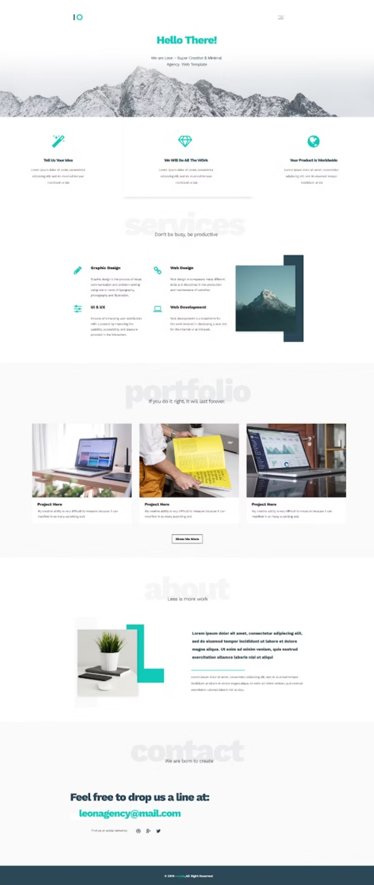

# Graphberry | Leon - PSD Agency solution

This is a solution to the [Leon - PSD Agency Template on Graphberry](https://www.graphberry.com/item/leon-psd-agency-template). Graphberry website help you improve your coding skills by building full web page design.

## Table of contents

- [Overview](#overview)
  - [The challenge](#the-challenge)
  - [Screenshot](#screenshot)
  - [Links](#links)
- [My process](#my-process)
  - [Built with](#built-with)

## Overview

### The challenge

Make the same design as in the [screenshot](#screenshot)

### Screenshot

### Links

- Solution URL: [Solution URL](https://github.com/Shady-Mo/Leon-PSD-Agency)
- Live Site URL: [Live preview](https://shady-mo.github.io/Leon-PSD-Agency/)

## My process

### Built with

- HTML 5
- Semantic HTML
- CSS properties
- Flexbox
- Grid
- Responsive
